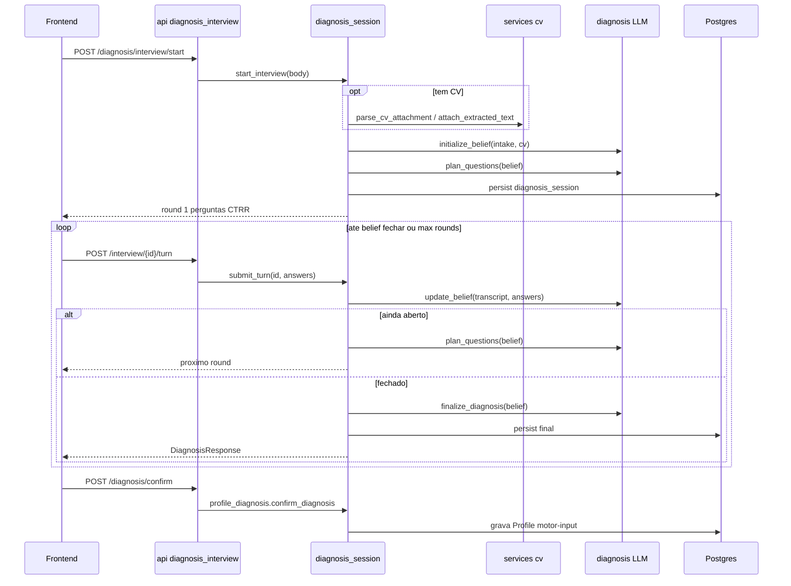
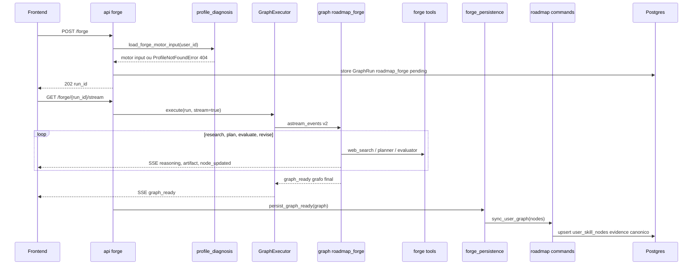
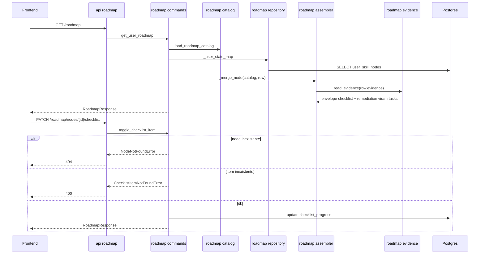
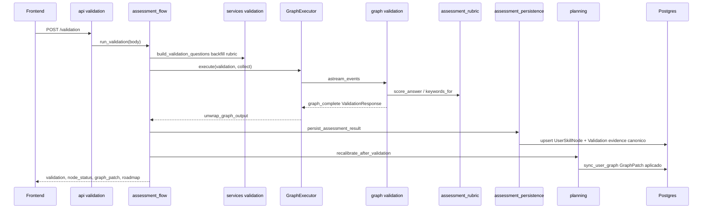
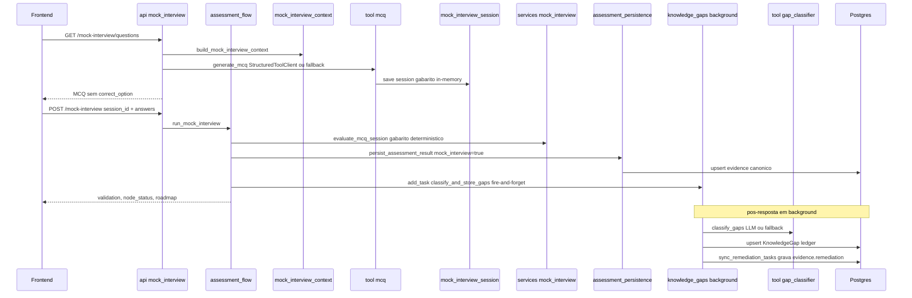
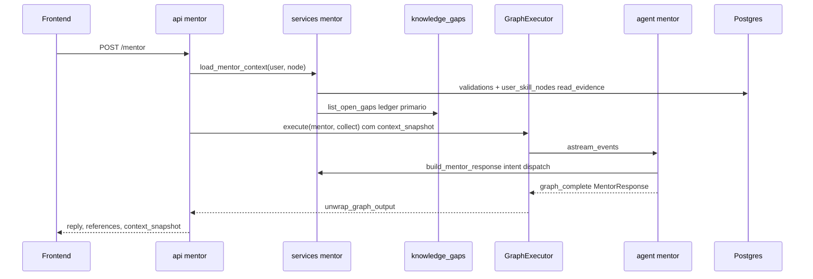
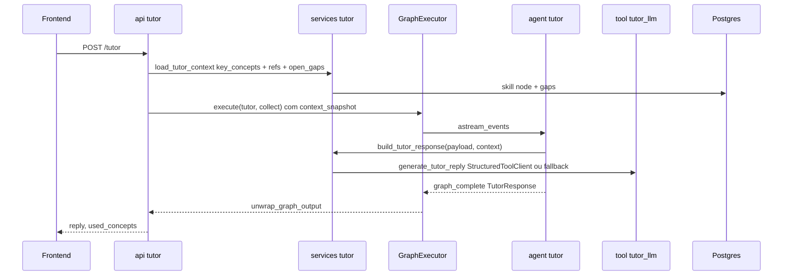
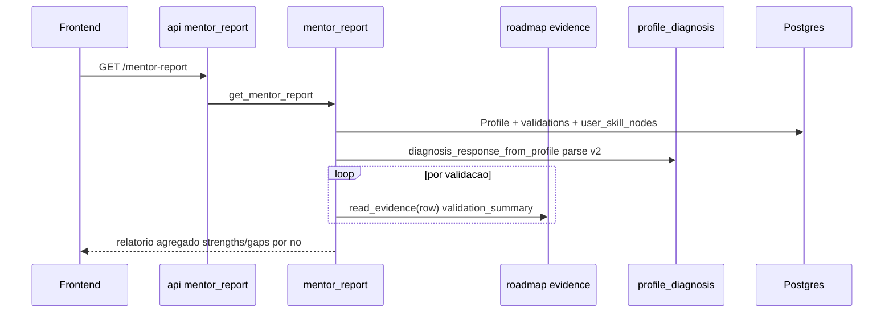

# Arquitetura — Career Forge (backend)

> **Para o reviewer:** este documento mostra a arquitetura do backend **depois** do
> ciclo de refactor pós-entrega (HAC-73 … HAC-85). Todos os diagramas são
> [Mermaid](https://mermaid.js.org/) — o GitHub **renderiza nativamente** ao abrir
> este `.md` (sem plugin). Se algum diagrama aparecer como código, recarregue a
> página; o GitHub às vezes faz cache do render.

Camadas: **API** (rotas finas, só transporte) → **Services** (orquestração +
domínio) → **AI** (executor/factory/registry + graphs/agents/tools/llm) → **DB**.
Kernel compartilhado: `schemas/` + `errors.py` (erros de domínio).

---

## Padrões de execução

Existem **três** formas de uma rota chegar no resultado. Saber qual é cada uma
torna os diagramas de sequência muito mais fáceis de ler.

| Padrão | Quando | Caminho |
|--------|--------|---------|
| **executor-collect** | resultado único (sem stream) | rota → `GraphExecutor.execute(stream=False)` → `AgentFactory` → runnable → `unwrap_graph_output` |
| **executor-stream** | streaming SSE | rota → `GraphExecutor.execute(stream=True)` → gera eventos SSE |
| **service-direto** | sem grafo / lógica determinística | rota → service (sem executor) |

| Feature | Padrão |
|---------|--------|
| Diagnosis (multi-turn CTRR) | service-direto (streaming próprio) |
| Live Roadmap Forge | executor-stream |
| Roadmap (steady-state / toggle) | service-direto |
| Validation | executor-collect (via `assessment_flow`) |
| Mock Interview (MCQ) | service-direto p/ scoring + executor p/ open-text legado |
| Mentor | executor-collect (agent embrulha service) |
| Tutor | executor-collect (agent embrulha service) |
| Mentor Report | service-direto |
| Knowledge Gaps / Remediação | background task (fire-and-forget) |

---

## Diagrama de dependência (módulos pós-refactor)

**Regra de direção (o que o refactor fixou):** `API → Services → DB/kernel`.
O HAC-77 removeu a inversão **services → ai/graphs**. A única dependência "para
cima" sancionada é **graphs/agents → services** (os runnables são finos e
embrulham o domínio determinístico). `catalog` e `evidence` são folhas (sem
dependências internas no pacote `roadmap/`).

---

## Sequência — Diagnosis Interview (multi-turn CTRR)

`service-direto` — não passa pelo `GraphExecutor`; tem streaming próprio.

---

## Sequência — Live Roadmap Forge

`executor-stream` — POST cria o run (pending), o GET consome o SSE.

---

## Sequência — Roadmap (steady-state + checklist toggle)

`service-direto` — através do pacote `roadmap/`.

---

## Sequência — Validation

`executor-collect` orquestrado por `assessment_flow`.

---

## Sequência — Mock Interview MCQ (+ loop de gaps e remediação)

`service-direto` para scoring determinístico + background fire-and-forget.

---

## Sequência — Mentor

`executor-collect` — o agent embrulha o service determinístico.

---

## Sequência — Tutor (Q&A do capítulo)

`executor-collect` — o agent embrulha o service.

---

## Sequência — Mentor Report

`service-direto` — agrega histórico de validações.

---

## Decisões arquiteturais (pontos de revisão)

1. **`ai/graphs` e `ai/agents` dependem de `services`** (runnables embrulham o
   domínio determinístico). É a única dependência "para cima". Alternativa:
   mover a lógica determinística (rubric/mentor/tutor) para um pacote `domain/`
   neutro. Mantido como está — runnables finos e previsíveis.
2. **Dois clients LLM**: `StructuredLlmClient` (async, diagnosis) e
   `StructuredToolClient` (sync, tools). Unificar num só com `invoke`/`ainvoke`
   seria mais limpo (ficou fora do escopo do HAC-82).
3. **Diagnosis tem dois caminhos**: o multi-turn real (`diagnosis_session`,
   service-direto) + um `diagnosis` graph legado via executor
   (`api/diagnosis.create_diagnosis`) que o front não usa mais → candidato a
   remoção de dead-code.
4. **Sessão MCQ é in-memory** (`mock_interview_session`): o gabarito não
   persiste. Simples e suficiente para o fluxo, mas é estado efêmero (perde em
   restart / múltiplas instâncias).
5. **Evidence normalizado (HAC-85)**: um envelope canônico
   `{checklist, validation, remediation, metadata}` + `read_evidence` como único
   adapter de leitura do legado. Escrita só no shape novo; migração **lazy** (sem
   rewrite em massa). Remediação numa chave dedicada, desacoplada do checklist.
6. **`assessment_flow` mantém `except Exception` amplo** no persist/recalibrate
   (resiliência herdada das rotas) — preservado para não mudar comportamento;
   poderia virar fail-fast.

---

## Documentos relacionados

- [docs/engineering/EXECUTION-FLOW.md](./engineering/EXECUTION-FLOW.md) — árvore E2E + ordem de dispatch
- [docs/engineering/AI-EXECUTION.md](./engineering/AI-EXECUTION.md) — GraphRun, GraphExecutor, AgentFactory
- [docs/engineering/REPO-STRUCTURE.md](./engineering/REPO-STRUCTURE.md) — layout de pastas
- [docs/CHECKPOINT.md](./CHECKPOINT.md) — overview de produto + stack
