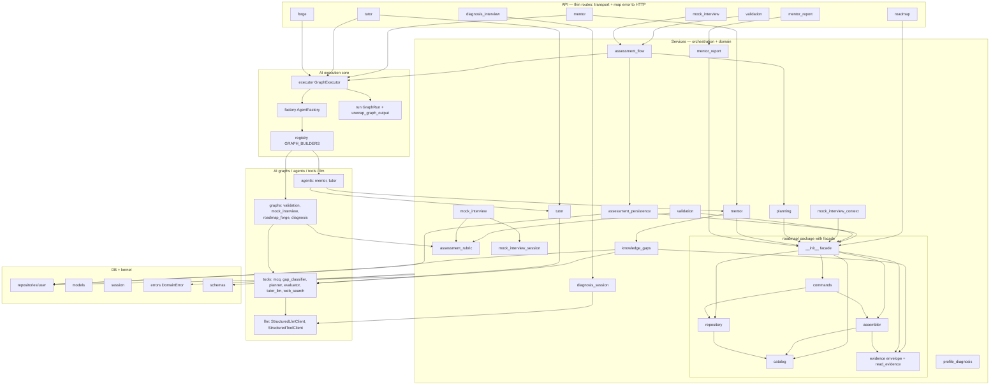
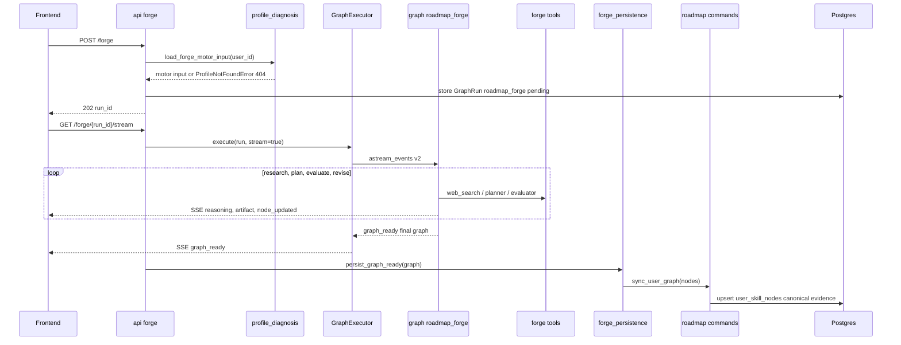
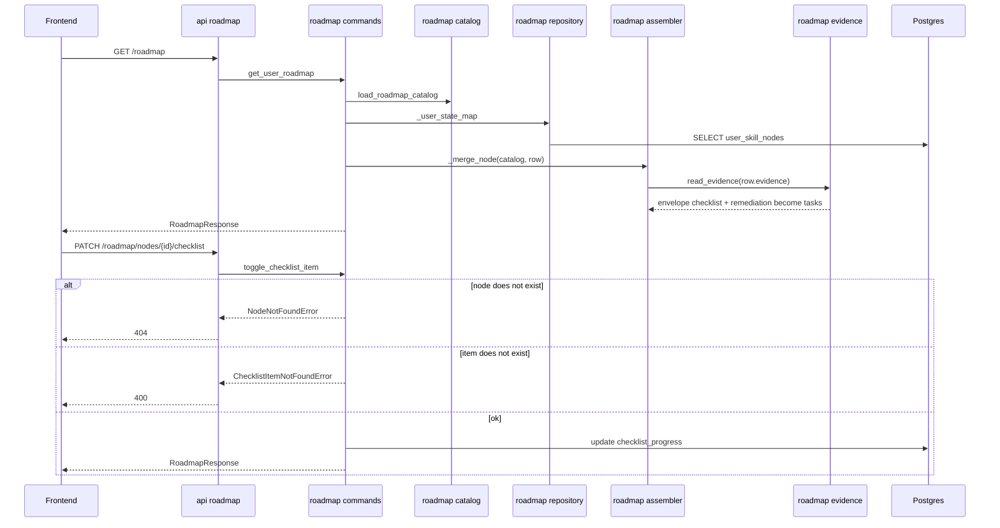
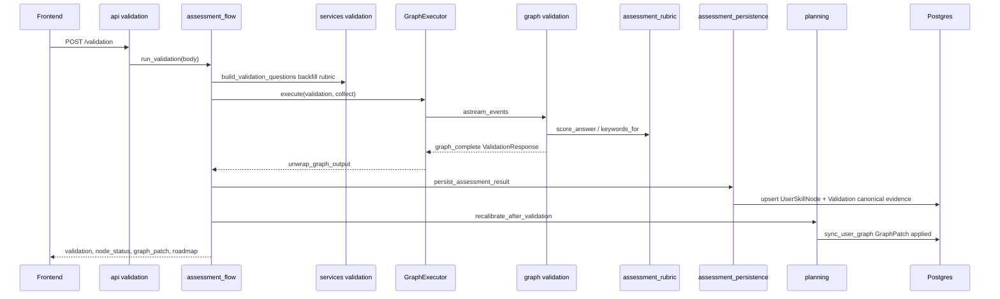
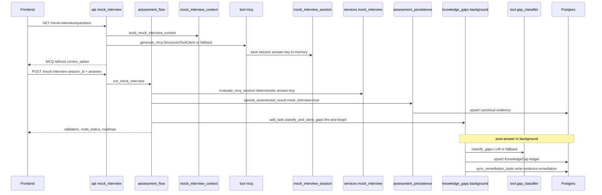
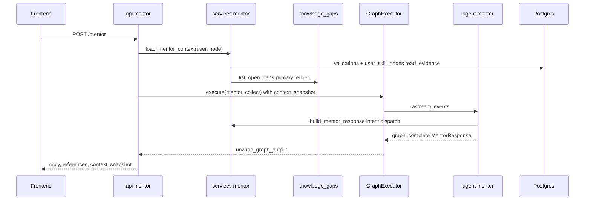
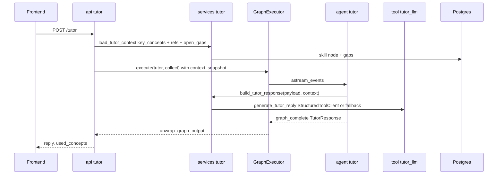
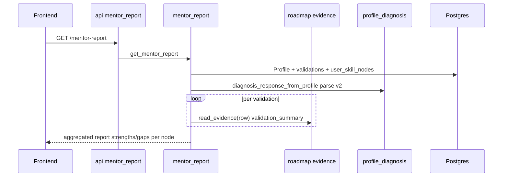

# Architecture — Career Forge (backend)

> **For the reviewer:** this document shows the backend architecture **after** the
> post-delivery refactor cycle (HAC-73 … HAC-85). All diagrams are
> [Mermaid](https://mermaid.js.org/) — GitHub **renders them natively** when you open
> this `.md` (no plugin). If a diagram shows up as code, reload the
> page; GitHub sometimes caches the render.

Layers: **API** (thin routes, transport only) → **Services** (orchestration +
domain) → **AI** (executor/factory/registry + graphs/agents/tools/llm) → **DB**.
Shared kernel: `schemas/` + `errors.py` (domain errors).

---

## Execution patterns

There are **three** ways a route reaches its result. Knowing which is which
makes the sequence diagrams much easier to read.

| Pattern | When | Path |
|--------|--------|---------|
| **executor-collect** | single result (no stream) | route → `GraphExecutor.execute(stream=False)` → `AgentFactory` → runnable → `unwrap_graph_output` |
| **executor-stream** | SSE streaming | route → `GraphExecutor.execute(stream=True)` → emits SSE events |
| **service-direto** | no graph / deterministic logic | route → service (no executor) |

| Feature | Pattern |
|---------|--------|
| Diagnosis (multi-turn CTRR) | service-direto (own streaming) |
| Live Roadmap Forge | executor-stream |
| Roadmap (steady-state / toggle) | service-direto |
| Validation | executor-collect (via `assessment_flow`) |
| Mock Interview (MCQ) | service-direto for scoring + executor for legacy open-text |
| Mentor | executor-collect (agent wraps service) |
| Tutor | executor-collect (agent wraps service) |
| Mentor Report | service-direto |
| Knowledge Gaps / Remediation | background task (fire-and-forget) |

---

## Dependency diagram (post-refactor modules)

**Direction rule (what the refactor locked in):** `API → Services → DB/kernel`.
HAC-77 removed the **services → ai/graphs** inversion. The only sanctioned "upward"
dependency is **graphs/agents → services** (the runnables are thin and
wrap the deterministic domain). `catalog` and `evidence` are leaves (no
internal dependencies within the `roadmap/` package).

---

## Sequence — Diagnosis Interview (multi-turn CTRR)

`service-direto` — does not go through `GraphExecutor`; it has its own streaming.

---

## Sequence — Live Roadmap Forge

`executor-stream` — POST creates the run (pending), GET consumes the SSE.

---

## Sequence — Roadmap (steady-state + checklist toggle)

`service-direto` — through the `roadmap/` package.

---

## Sequence — Validation

`executor-collect` orchestrated by `assessment_flow`.

---

## Sequence — Mock Interview MCQ (+ gaps and remediation loop)

`service-direto` for deterministic scoring + fire-and-forget background.

---

## Sequence — Mentor

`executor-collect` — the agent wraps the deterministic service.

---

## Sequence — Tutor (chapter Q&A)

`executor-collect` — the agent wraps the service.

---

## Sequence — Mentor Report

`service-direto` — aggregates validation history.

---

## Architectural decisions (review points)

1. **`ai/graphs` and `ai/agents` depend on `services`** (runnables wrap the
   deterministic domain). It is the only "upward" dependency. Alternative:
   move the deterministic logic (rubric/mentor/tutor) into a neutral `domain/`
   package. Kept as is — thin, predictable runnables.
2. **Two LLM clients**: `StructuredLlmClient` (async, diagnosis) and
   `StructuredToolClient` (sync, tools). Unifying them into one with `invoke`/`ainvoke`
   would be cleaner (it was out of scope for HAC-82).
3. **Diagnosis has two paths**: the real multi-turn one (`diagnosis_session`,
   service-direto) + a legacy `diagnosis` graph via the executor
   (`api/diagnosis.create_diagnosis`) that the frontend no longer uses → candidate for
   dead-code removal.
4. **MCQ session is in-memory** (`mock_interview_session`): the answer key is not
   persisted. Simple and sufficient for the flow, but it is ephemeral state (lost on
   restart / multiple instances).
5. **Normalized evidence (HAC-85)**: a canonical envelope
   `{checklist, validation, remediation, metadata}` + `read_evidence` as the single
   read adapter for the legacy format. Writes only in the new shape; **lazy** migration (no
   mass rewrite). Remediation in a dedicated key, decoupled from the checklist.
6. **`assessment_flow` keeps a broad `except Exception`** in persist/recalibrate
   (resilience inherited from the routes) — preserved to avoid changing behavior;
   could become fail-fast.

---

## Related documents

- [docs/engineering/EXECUTION-FLOW.md](./engineering/EXECUTION-FLOW.md) — E2E tree + dispatch order
- [docs/engineering/AI-EXECUTION.md](./engineering/AI-EXECUTION.md) — GraphRun, GraphExecutor, AgentFactory
- [docs/engineering/REPO-STRUCTURE.md](./engineering/REPO-STRUCTURE.md) — folder layout
- [docs/CHECKPOINT.md](./CHECKPOINT.md) — product + stack overview
