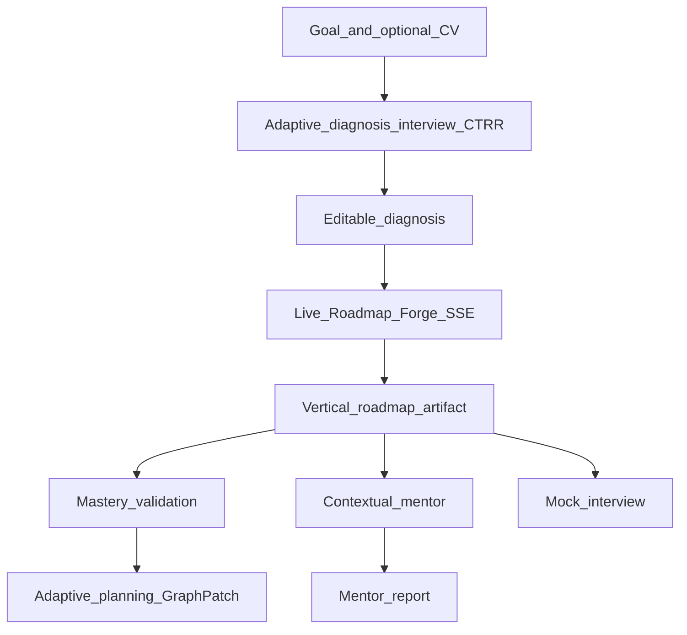

# CHECKPOINT — Career Forge product

> **Navigation:** [V2-PLAN](./V2-PLAN.md) · [ROADMAP](./ROADMAP.md) · [STATUS](./STATUS.md) · [claude-design-docs](../claude-design-docs/)

Authoritative product + architecture reference for agents.

---

## One-liner

**Career Forge** — adaptive skill graph that diagnoses, forges the roadmap live, validates mastery, and generates evidence for mentors.

Sub-theme: **Learning with practical validation** (mastery before progression).

**Audience (v2):** BASE and PSP learners only — spectrum from ~6 months XP to decades. Goals repositioned to **LLM engineer** tracks (RAG, Agents, Evals, Fine-tuning).

**AI-first rule:** remove AI → app stops. Identity/diagnosis **must** be LLM-driven ([ADR-001](./decisions/ADR-001-adaptive-diagnosis-ctrr.md)).

**Deploy:** `https://labs.borderlesscoding.com/career-forge` (app under `/career-forge/app`).

---

## Wow features (priority)

| P | Feature | User reaction |
|---|---------|---------------|
| P0 | **Live Roadmap Forge** | "I can see the AI thinking and building MY roadmap" |
| P0 | **Mastery Validation** | "It won't let me pretend I learned" |
| P0 | **Adaptive graph** | "The roadmap changed because I got it wrong" |
| P1 | Contextual Mentor | "It knows where I got stuck" |
| P1 | Mock → recalibrates | "The interview changes the plan" |

---

## v2 goals (LLM tracks)

| Goal id | Track |
|---------|-------|
| `rag-engineer` | Production RAG & Advanced Retrieval |
| `agent-engineer` | Agent Engineering (MCP, Tool Use, Failure Modes) |
| `llm-evals` | LLM Evaluation & Observability (LLMOps) |
| `fine-tuning` | Fine-Tuning & Alignment (LoRA, DPO, Custom Models) |

Catalog seeds land in F1 (CAR-5). Must-have nodes (job-market lean fit) draft in CAR-8; wired in F2.

---

## Cost & access (v2)

- Hard stop: **R$500/month** global API pool (all billable GraphRuns)
- Gate approval ceiling: **R$700** (Yuri go/no-go)
- Per-user forge cap (1–2/month after gate)
- Soft gate on diagnosis in pilot (lean forge + warning); hard block = later
- First humans: **F3 only**, after platform auth + caps
- Demo user `demo-ana`: outside student cost pool

Details: [V2-PLAN.md](./V2-PLAN.md)

---

## Stack (closed)

```
apps/frontend/     Next.js + TS + Tailwind
apps/backend/      FastAPI + Pydantic + SQLAlchemy
PostgreSQL         skill graph state, validations, profiles, graph_runs
LangGraph          diagnosis, diagnosis_interview, roadmap_forge, validation, mock_interview
LangChain          astream_events v2 via GraphExecutor
LangSmith          traces per GraphRun
```

## Application map (implemented)



### Frontend routes

| Route | Purpose |
|---|---|
| `(setup)/` | Goal entry |
| `(setup)/onboarding` | Adaptive diagnosis interview (CTRR) |
| `(setup)/onboarding/edit` | Editable diagnosis |
| `(setup)/forge` | Live forge timeline SSE |
| `(setup)/forge/complete` | Post-forge transition |
| `(artifact)/roadmap` | Vertical steady-state trail |
| `(artifact)/validate` | Mastery validation interview |
| `(artifact)/report` | Mentor report (Borderless) |

### API surface

| Prefix | Key endpoints |
|---|---|
| `/health` | Health probe used by smoke/deploy |
| `/demo/ana` | Demo seed user |
| `/diagnosis` | Legacy single-shot diagnosis |
| `/diagnosis/interview/start`, `/diagnosis/interview/{session_id}/turn` | Multi-turn CTRR diagnosis interview |
| `/forge`, `/forge/{run_id}/stream` | Forge run + SSE timeline |
| `/roadmap/`, `/roadmap/sync` | Steady-state trail + sync |
| `/validation/questions`, `/validation` | Mastery validation |
| `/mentor/context`, `/mentor` | Contextual mentor |
| `/mentor-report` | Mentor evidence report |
| `/mock-interview/questions`, `/mock-interview` | Mock interview loop + recalibration |

## Data model summary

Core models under `apps/backend/src/career_forge/db/models/`:

- `user.py`, `profile.py` — user identity and profile context
- `skill_node.py`, `user_skill_node.py` — static catalog node + personalized node state
- `validation.py` — mastery validation runs/evidence
- `diagnosis_session.py` — multi-turn interview sessions
- `graph_run.py` — GraphExecutor run audit trail (`graph_runs`)

## Deployment baseline

- Primary runbook: [DEPLOY-LABS-MANUAL.md](./DEPLOY-LABS-MANUAL.md) — path `labs.borderlesscoding.com/career-forge`
- Images: GHCR (`ghcr.io/pedroalano/career-forge-{backend,frontend}` or org GHCR as configured)
- Post-deploy: `curl -fsS` health on API path under Labs

## AI execution layer

Unified under `career_forge/ai/`:

- **GraphRun** — one execution record (id, graph_name, user_id, status, I/O, events)
- **AgentFactory** — `factory.get("roadmap_forge")` → configured runnable
- **GraphExecutor** — always `astream_events` v2; `stream=False` collects, `stream=True` → SSE
- **Registry** — `diagnosis`, `diagnosis_interview`, `roadmap_forge`, `validation`, `mock_interview`, `mentor`

Canonical doc: [engineering/EXECUTION-FLOW.md](./engineering/EXECUTION-FLOW.md) · [engineering/AI-EXECUTION.md](./engineering/AI-EXECUTION.md) · [ARCHITECTURE.md](./ARCHITECTURE.md)

---

## Live Roadmap Forge

Post-onboarding LangGraph loop:

1. `load_topics` — roadmap.json catalog
2. `analyze_gaps` — LLM streams reasoning
3. `research_enrich` — OpenAI native `web_search` + official source citations
4. `plan_study_graph` — planner LLM creates a structured `StudyPlan`
5. `evaluate_plan` — mini evaluator returns `ship|revise`; feedback can loop back into planner
6. `accumulate_graph` — converts approved `StudyPlan` into `graph_ready` nodes with tasks/references/prerequisites
7. `emit_final` — SSE `graph_ready`

SSE events: `reasoning_delta`, `artifact_found` (with `sources[]` for web search), `node_updated`, `step_complete`, `graph_ready`

---

## Skill graph model

**Static catalog:** `data/roadmap.json` — nodes, prerequisites, outcomes, rubric

**Dynamic state:** `user_skill_nodes` — status, mastery_score, evidence[]

Statuses: `bloqueado | recomendado | em_estudo | validar | aprovado | revisar`

---

## UI reference

Canonical UX: [claude-design-docs/UX-FLOW.md](../claude-design-docs/UX-FLOW.md) · [SCREEN-INTENT.md](../claude-design-docs/SCREEN-INTENT.md)

Claude Design prototype: [claude-design-docs/prototype/](../claude-design-docs/prototype/) — tokens/components; rebrand tokens in F3.

**Visual identity:** Borderless Community theming — [BORDERLESS-THEMING.md](../claude-design-docs/BORDERLESS-THEMING.md). Brand kit colors for v2: `#121212` / `#5316CC` / `#44D5AD`.

---

## Adaptive diagnosis (ADR-001)

Screen 2 is live: **CTRR** rubric + Interviewer/Judge loop — max 2 questions/turn, optional PDF CV, accumulative transcript → `DiagnosisResponse`.

v2: recalibrate prompts for BASE/PSP + practical / system-AI questions; **soft gate** below score (lean forge + warning) in the pilot.

Spec: [product/DIAGNOSIS-INTERVIEW.md](./product/DIAGNOSIS-INTERVIEW.md)

---

## Runtime environments

| Environment | Baseline |
|---|---|
| Local dev | `make up` (`docker-compose.yml`) + `.env.example` |
| Verification | `make smoke`, `make agent-verify`, backend `/health` |
| Labs | GHCR + VPS Labs + host nginx path (see DEPLOY-LABS-MANUAL) |

## Documentation quick index

| Need | Read |
|---|---|
| v2 plan / decisions | [V2-PLAN.md](./V2-PLAN.md) |
| Product overview | [CHECKPOINT.md](./CHECKPOINT.md) |
| Current work | [ROADMAP.md](./ROADMAP.md), [STATUS.md](./STATUS.md) |
| AI runtime | [engineering/EXECUTION-FLOW.md](./engineering/EXECUTION-FLOW.md), [engineering/AI-EXECUTION.md](./engineering/AI-EXECUTION.md) |
| Deploy Labs | [DEPLOY-LABS-MANUAL.md](./DEPLOY-LABS-MANUAL.md) |
| Diagnosis | [product/DIAGNOSIS-INTERVIEW.md](./product/DIAGNOSIS-INTERVIEW.md) |

## Demo script (5 min)

1. Goal + motivation (+ optional CV)
2. AI diagnosis interview → editable diagnosis
3. **Editable diagnosis** — adjust gap, click **"Generate roadmap"**
4. **Forge stream** (timeline steps 1–N, no graph) → **animation reveal** → vertical roadmap
5. Validate → score / adapt
6. Mentor / AI sidebar

---

## Out of scope (v2)

See [V2-PLAN.md](./V2-PLAN.md) — SSO beyond platform, Stripe, job-RAG forge, Frame landing, hard diagnosis block, OPS dashboards.
