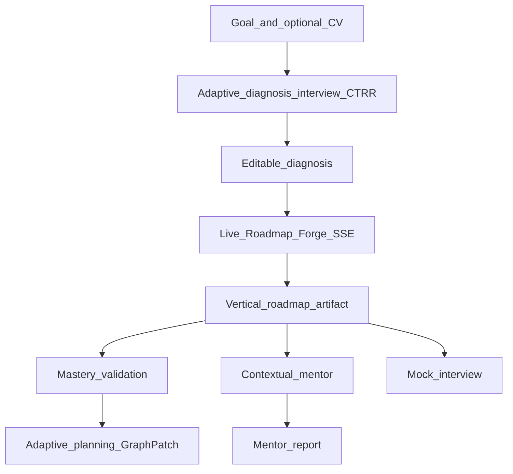

# CHECKPOINT — Career Forge product

> **Navigation:** [ROADMAP](./ROADMAP.md) · [STATUS](./STATUS.md) · [claude-design-docs](../claude-design-docs/)

Authoritative product + architecture reference for agents.

---

## One-liner

**Career Forge** — skill graph adaptativo que diagnostica, forja trilha ao vivo, valida mastery e gera evidências para mentores.

Sub-eixo: **Aprender com validação prática** (Alpha School: mastery before progression).

**Audience:** career transition to tech (often zero or early study) — not senior hiring.

**AI-first rule:** remove AI → app stops. Identity/diagnosis **must** be LLM-driven ([ADR-001](./decisions/ADR-001-adaptive-diagnosis-ctrr.md)).

---

## Wow features (priority)

| P | Feature | User reaction |
|---|---------|---------------|
| P0 | **Live Roadmap Forge** | "Tô vendo a IA pensar e montar MINHA trilha" |
| P0 | **Mastery Validation** | "Não deixa eu mentir que aprendi" |
| P0 | **Adaptive graph** | "A trilha mudou porque eu errei" |
| P1 | Contextual Mentor | "Sabe onde eu travei" |
| P1 | Mock → recalibra | "Entrevista muda o plano" |

---

## Stack (closed)

```
apps/frontend/     Next.js + TS + Tailwind
apps/backend/     FastAPI + Pydantic + SQLAlchemy
PostgreSQL    skill graph state, validations, profiles, graph_runs
LangGraph     diagnosis_graph, diagnosis_interview_graph, roadmap_forge_graph, validation_graph, mock_interview_graph
LangChain     astream_events v2 via GraphExecutor (HAC-32)
LangSmith     traces per GraphRun
```

## Application map (implemented)



### Frontend routes

| Route | Purpose |
|---|---|
| `(setup)/` | Goal entry |
| `(setup)/onboarding` | Adaptive diagnosis interview (CTRR) |
| `(setup)/onboarding/edit` | Editable diagnosis |
| `(setup)/forge` | Live forge timeline SSE |
| `(setup)/forge/complete` | Post-forge transition |
| `(artifact)/roadmap` | Vertical steady-state trail |
| `(artifact)/validate` | Mastery validation interview |
| `(artifact)/report` | Mentor report (Borderless) |

### API surface

| Prefix | Key endpoints |
|---|---|
| `/health` | Health probe used by smoke/deploy |
| `/demo/ana` | Demo seed user |
| `/diagnosis` | Legacy single-shot diagnosis |
| `/diagnosis/interview/start`, `/diagnosis/interview/{session_id}/turn` | Multi-turn CTRR diagnosis interview |
| `/forge`, `/forge/{run_id}/stream` | Forge run + SSE timeline |
| `/roadmap/`, `/roadmap/sync` | Steady-state trail + sync |
| `/validation/questions`, `/validation` | Mastery validation |
| `/mentor/context`, `/mentor` | Contextual mentor |
| `/mentor-report` | Mentor evidence report |
| `/mock-interview/questions`, `/mock-interview` | Mock interview loop + recalibration |

## Data model summary

Core models under `apps/backend/src/career_forge/db/models/`:

- `user.py`, `profile.py` — user identity and profile context
- `skill_node.py`, `user_skill_node.py` — static catalog node + personalized node state
- `validation.py` — mastery validation runs/evidence
- `diagnosis_session.py` — multi-turn interview sessions
- `graph_run.py` — GraphExecutor run audit trail (`graph_runs`)

## Deployment baseline

- Production images are published to `ghcr.io/pedroalano/career-forge-{backend,frontend}:latest`.
- Canonical server deploy path is VPS + host nginx + `docker-compose.prod.yml` over SSH workflow.
- Post-deploy verification is `curl -fsS "https://$API_DOMAIN/health"` (no Python dependency on VPS image).

## AI execution layer (HAC-32)

Unified under `career_forge/ai/`:

- **GraphRun** — one execution record (id, graph_name, user_id, status, I/O, events)
- **AgentFactory** — `factory.get("roadmap_forge")` → configured runnable
- **GraphExecutor** — always `astream_events` v2; `stream=False` collects, `stream=True` → SSE
- **Registry** — `diagnosis`, `diagnosis_interview`, `roadmap_forge`, `validation`, `mock_interview`, `mentor`

Canonical doc: [engineering/EXECUTION-FLOW.md](./engineering/EXECUTION-FLOW.md) · [engineering/AI-EXECUTION.md](./engineering/AI-EXECUTION.md)

---

## Live Roadmap Forge (HAC-18)

Post-onboarding LangGraph loop:

1. `load_topics` — roadmap.json catalog
2. `analyze_gaps` — LLM streams reasoning
3. `research_enrich` — OpenAI native `web_search` + official source citations
4. `plan_study_graph` — planner LLM creates a structured `StudyPlan`
5. `evaluate_plan` — mini evaluator returns `ship|revise`; feedback can loop back into planner
6. `accumulate_graph` — converts approved `StudyPlan` into `graph_ready` nodes with tasks/references/prerequisites
7. `emit_final` — SSE `graph_ready`

SSE events: `reasoning_delta`, `artifact_found` (with `sources[]` for web search), `node_updated`, `step_complete`, `graph_ready`

Full spec: [stack-and-roadmap-forge.md](./stack-and-roadmap-forge.md)

---

## Skill graph model

**Static catalog:** `data/roadmap.json` — nodes, prerequisites, outcomes, rubric

**Dynamic state:** `user_skill_nodes` — status, mastery_score, evidence[]

Statuses: `bloqueado | recomendado | em_estudo | validar | aprovado | revisar`

---

## UI reference

Canonical UX (HAC-21): [claude-design-docs/UX-FLOW.md](../claude-design-docs/UX-FLOW.md) · [SCREEN-INTENT.md](../claude-design-docs/SCREEN-INTENT.md)

Claude Design prototype: [claude-design-docs/prototype/](../claude-design-docs/prototype/) — tokens/components only; flow may lag docs.

**Visual identity (HAC-23):** Borderless Community theming — deep purple-black, purple roadmap nodes, cyan progress, sidebar + canvas shell. Canonical: [BORDERLESS-THEMING.md](../claude-design-docs/BORDERLESS-THEMING.md). Primary reference: [borderless-code-breakers-dashboard.png](../claude-design-docs/references/borderless-code-breakers-dashboard.png). Steady state: canvas roadmap + optional AI sidebar (roadmap.sh layout secondary).

---

## Adaptive diagnosis (ADR-001 — Sprint 6 done)

Screen 2 is live: **CTRR** rubric + Interviewer/Judge loop — max 2 questions/turn, optional PDF CV, accumulative transcript → `DiagnosisResponse`.

Spec: [product/DIAGNOSIS-INTERVIEW.md](./product/DIAGNOSIS-INTERVIEW.md)

---

## Runtime environments

| Environment | Baseline |
|---|---|
| Local dev | `make up` (`docker-compose.yml`) + `.env.example` |
| Verification | `make smoke`, `make agent-verify`, backend `/health` |
| Production | GHCR + VPS (`docker-compose.prod.yml`) + host nginx + Certbot |

## Documentation quick index

| Need | Read |
|---|---|
| Product/feature overview | [CHECKPOINT.md](./CHECKPOINT.md) |
| Sprint ordering and issue status | [ROADMAP.md](./ROADMAP.md), [SPRINT-BOARD.md](./SPRINT-BOARD.md), [STATUS.md](./STATUS.md) |
| AI runtime internals | [engineering/EXECUTION-FLOW.md](./engineering/EXECUTION-FLOW.md), [engineering/AI-EXECUTION.md](./engineering/AI-EXECUTION.md) |
| Deploy and ops | [engineering/DEPLOY-VPS.md](./engineering/DEPLOY-VPS.md) |
| Diagnosis deep spec | [product/DIAGNOSIS-INTERVIEW.md](./product/DIAGNOSIS-INTERVIEW.md) |

## Demo script (5 min)

1. Goal + motivation (+ optional CV)
2. AI diagnosis interview → diagnóstico editável
3. **Editable diagnosis** — ajustar lacuna, clicar **"Gerar roadmap"**
4. **Forge stream** (timeline passos 1–N, sem grafo) → **animation reveal** → vertical roadmap
5. Validar REST → resposta ruim → score
6. Roadmap reage + sugestão mentor / AI sidebar

---

## Out of scope (hackathon)

- Multiple full tracks
- Enterprise auth
- Gamification
- GitHub integration
- Web scraping for research (MVP: LLM-labeled research steps)

---

*HB01-2026 · Programadores Sem Pátria*
