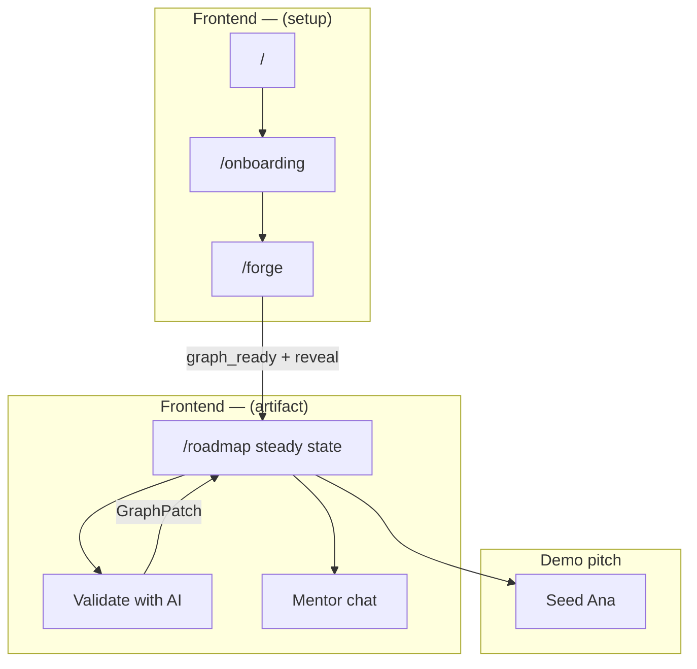
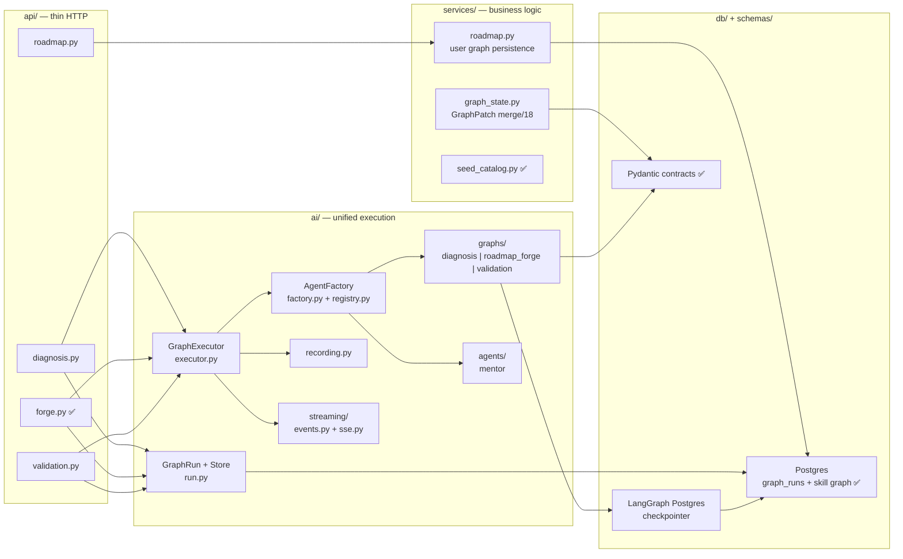
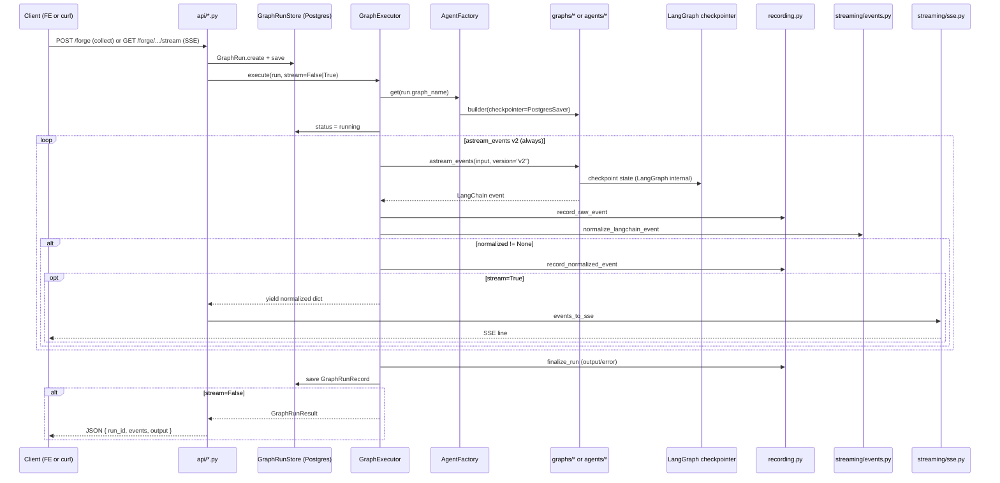

# Execution flow — Career Forge (canonical)

> **Navigation:** [AI-EXECUTION.md](./AI-EXECUTION.md) · [REPO-STRUCTURE.md](./REPO-STRUCTURE.md) · [V2-PLAN.md](../V2-PLAN.md) · [CHECKPOINT.md](../CHECKPOINT.md)

End-to-end execution tree and architecture for the LangGraph motor (unchanged in v2).

Last updated: **2026-07-21**

---

## State snapshot

| Area | Status |
|------|--------|
| AI layer | ✅ `career_forge/ai/` — GraphRun, GraphExecutor, AgentFactory |
| Graph builders | ✅ `diagnosis`, `diagnosis_interview`, `roadmap_forge`, `validation`, `mock_interview`; mentor as agent runnable |
| HTTP | ✅ diagnosis, diagnosis interview, forge, roadmap, validation, mentor, mentor report, mock interview routes wired |
| Persistence | ✅ `GraphRunRecord` + `graph_runs` table; diagnosis sessions and skill graph state persisted in Postgres |
| v2 work | See [V2-PLAN.md](../V2-PLAN.md) / [ROADMAP.md](../ROADMAP.md) — goals, cost caps, Labs path |

---

## North star demo flow

```
Onboarding (CTRR interview)
 → Live Roadmap Forge — timeline SSE only
 → animation reveal → vertical roadmap artifact
 → Validate with AI
 → roadmap reacts — GraphPatch
 → optional mentor / mock / demo-ana
```

**User reaction targets:** "I can see the AI thinking" (forge stream) · "It won't let me fake that I learned" (validation) · "The roadmap changed because I got it wrong" (adaptive).

Full demo script: [CHECKPOINT.md](../CHECKPOINT.md) § Demo script.

---

## User journey — `(setup)` vs `(artifact)`



| Layer | Route group | Purpose |
|-------|-------------|---------|
| **(setup)** | `(setup)/` | Editable diagnosis onboarding () → Live Roadmap Forge with **timeline-only SSE** during stream (). No graph preview during stream. |
| **(artifact)** | `(artifact)/` | Vertical roadmap.sh-style trail () → mastery validation () → adaptive graph () → demo Ana (). |

---

## Backend flow — API → services → ai/



**Layer rules:** `api/` creates `GraphRun` and calls `GraphExecutor` only. `services/` handles deterministic merge and DB persistence — no streaming. `ai/` owns all LangChain/LangGraph execution. For endpoint-level API map, see [CHECKPOINT.md](../CHECKPOINT.md) § Application map.

---

## GraphExecutor — single path (stream vs collect)



**Golden rule:** `astream_events` v2 lives **only** in `GraphExecutor`. Never duplicate streaming in `api/` or per-graph modules.

Details: [AI-EXECUTION.md](./AI-EXECUTION.md)

---

## Persistence — Postgres checkpointer (canonical)

Two complementary Postgres layers:

| Layer | Purpose | Implementation |
|-------|---------|----------------|
| **GraphRun store** | Application audit record — id, graph_name, user_id, status, I/O, raw/normalized events | `GraphRunRecord` → `graph_runs` table (Alembic `002_graph_runs`). Implement `PostgresGraphRunStore` satisfying `GraphRunStore` protocol in `ai/run.py`. |
| **LangGraph checkpointer** | Graph internal state between nodes / resume / human-in-the-loop | LangGraph **Postgres checkpointer** pattern (`PostgresSaver` / `langgraph-checkpoint-postgres`). Same Postgres instance; separate checkpoint tables managed by LangGraph. |

**Canonical target:** Postgres for both layers. **`InMemoryGraphRunStore`** remains as dev/test fallback (pytest, local smoke without DB) — not production default.

**Wiring status ():**

- ✅ `GraphRunRecord` model + `graph_runs` migration
- ⬜ `PostgresGraphRunStore` replacing module-level `_default_store`
- ⬜ `PostgresSaver` injected into graph builders via `AgentFactory`
- ⬜ Replace `MockGraphRunnable` with compiled LangGraph graphs (/10/18)

---

## Issue placement map

| Issue | Layer | Target modules |
|-------|-------|----------------|
| **** ✅ | Infra | `apps/frontend`, `apps/backend`, `docker-compose`, `Makefile` |
| **** ✅ | Data | `data/roadmap.json`, `db/models/`, Alembic, `scripts/seed.py` |
| **** ✅ | Contracts | `schemas/diagnosis.py`, `forge.py`, `validation.py`, `planning.py` |
| **** ✅ | AI core | `ai/run.py`, `executor.py`, `factory.py`, `registry.py`, `recording.py`, `streaming/` |
| **** | Setup + diagnosis | `ai/graphs/diagnosis.py`, `api/diagnosis.py`, `(setup)/onboarding`, `components/diagnosis/` |
| **** | Forge wow | `ai/graphs/roadmap_forge.py`, `services/graph_state.py`, `api/forge.py` ✅, `(setup)/forge`, `components/forge/`, `components/streaming/` |
| **** | Artifact UI | `api/roadmap.py`, `services/roadmap.py`, `(artifact)/roadmap`, `components/roadmap/` |
| **** | Mastery loop | `ai/graphs/validation.py`, `api/validation.py`, validation UI in artifact |
| **** | Adaptive | `services/graph_state.py`, `schemas/planning.py`, post-validation recalibration |
| **** | Demo | seed Ana, E2E pitch 7 min |
| **** [P] | Stretch | `ai/agents/mentor.py`, mentor route, artifact sidebar |
| **** [P] | Stretch | mock interview loop (recalibrates trail) |
| **** [P] | Stretch | mentor report (depends ) |

---

## ASCII execution tree

```
Career Forge — E2E execution (post-)
│
├─ FRONTEND apps/frontend/src/
│ ├─ (setup)/
│ │ ├─ /onboarding ────────────── → POST /diagnosis
│ │ └─ /forge ─────────────────── → GET /forge/{run_id}/stream (SSE timeline)
│ └─ (artifact)/
│ └─ /roadmap ───────────────── → GET /roadmap
│ ├─ Validate ────────────── → POST /validation → GraphExecutor(validation)
│ ├─ Reactive roadmap ────── → services/graph_state.apply_graph_patch
│ ├─ Mentor chat ─────────── → GraphExecutor(mentor)
│ └─ Demo Ana ────────────── 
│
└─ BACKEND apps/backend/src/career_forge/
 ├─ api/ thin HTTP (creates GraphRun, calls executor)
 │ ├─ diagnosis.py [stub → ]
 │ ├─ forge.py [✅ wired]
 │ ├─ roadmap.py [stub → ]
 │ └─ validation.py [stub → ]
 │
 ├─ services/ business logic (no streaming)
 │ ├─ roadmap.py user graph persistence (/18)
 │ ├─ graph_state.py deterministic GraphPatch merge (/18)
 │ └─ seed_catalog.py ✅
 │
 ├─ ai/ unified execution 
 │ ├─ run.py GraphRun + GraphRunStore (Postgres canonical; InMemory dev fallback)
 │ ├─ executor.py SINGLE astream_events v2 path
 │ ├─ factory.py AgentFactory.get(name) + checkpointer injection
 │ ├─ registry.py diagnosis | roadmap_forge | validation | mentor
 │ ├─ recording.py raw + normalized events → GraphRun
 │ ├─ streaming/
 │ │ ├─ events.py LC v2 → RoadmapForgeEvent / graph_complete
 │ │ └─ sse.py wire SSE
 │ ├─ graphs/ LangGraph builders + PostgresSaver checkpointer
 │ └─ agents/ mentor ()
 │
 ├─ schemas/ Pydantic I/O ✅ 
 └─ db/ Postgres
 ├─ models/graph_run.py GraphRunRecord → graph_runs ✅
 └─ (LangGraph checkpoint tables via PostgresSaver)
```

---

## Parallel dispatch order

Reference: [parallel-dispatch.mdc](../../.cursor/rules/parallel-dispatch.mdc) · [ROADMAP.md](../ROADMAP.md)

| Issue | Class | Depends on | Parallel with |
|-------|-------|------------|---------------|
| ✅ | P | ✅ | , |
| ✅ | P | ✅ | , |
| ✅ | P | ✅ | , |
| ✅ | — | | — |
| ✅ | — | | — |
| **** | **S** | ,6,7 ✅ | **None** — next in queue |
| **** | **S** | | **None** until merges |
| **** | **S** | | **None** until merges |
| **** | **S** | | **None** |
| **** | **S** | | **None** |
| **** | **S** | | **None** |
| **** | **P** | | (after ) |
| **** | **P** | | (after ) |
| **** | **P** | + | , (after deps OK) |

### Dispatch quick reference

```
Sprint 1: [P] + + → ONE message, 3 subagents ✅
Sprint 2: [S] → ← NEXT (sequential)
Sprint 3: [S] 
Sprint 4: [S] → → 
Sprint 5: [P] + + → ONE message, 3 subagents
```

**Practical note:** within a single issue (e.g. a single CAR issue), FE and BE can progress in parallel on the same branch. Do **not** parallelize sibling issues in `[S]` chains before upstream merge.

---

## New session handoff

Bootstrap paste block and subagent Task template: [AGENTS.md](../../AGENTS.md) § New session — manual bootstrap.

---

## Git worktrees (agent isolation)

Use a **sibling worktree** outside the main checkout so issue work does not pollute the primary workspace:

```bash
# From career-forge-v2 on main
git worktree add ../worktrees/car-XX-<slug> -b CAR-XX-title-slug origin/main
cd ../worktrees/car-XX-<slug>
# implement → test → merge to main from worktree or main checkout
```

After merge + end-task:

```bash
git worktree remove ../worktrees/car-XX-<slug>
git branch -d CAR-XX-title-slug
```

Keep `main` clean for harness/docs and parallel prep; one worktree per active `[S]` issue.

---

*Career Forge v2 · Borderless Labs*
