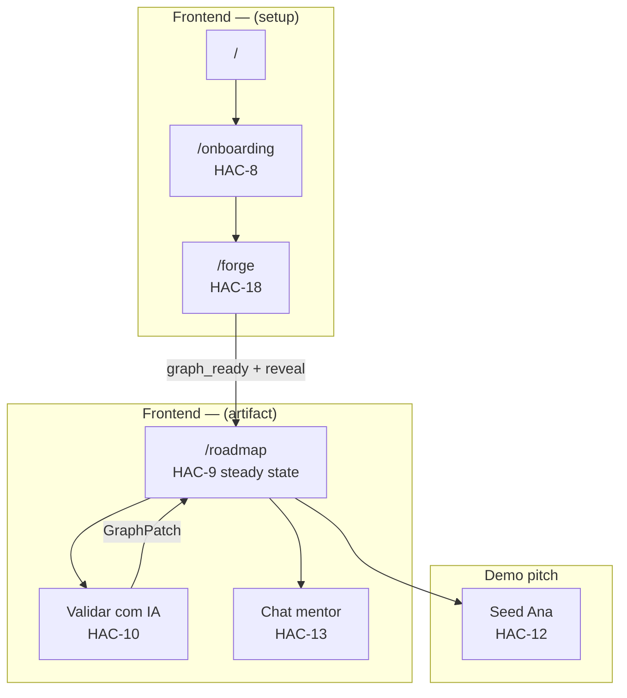
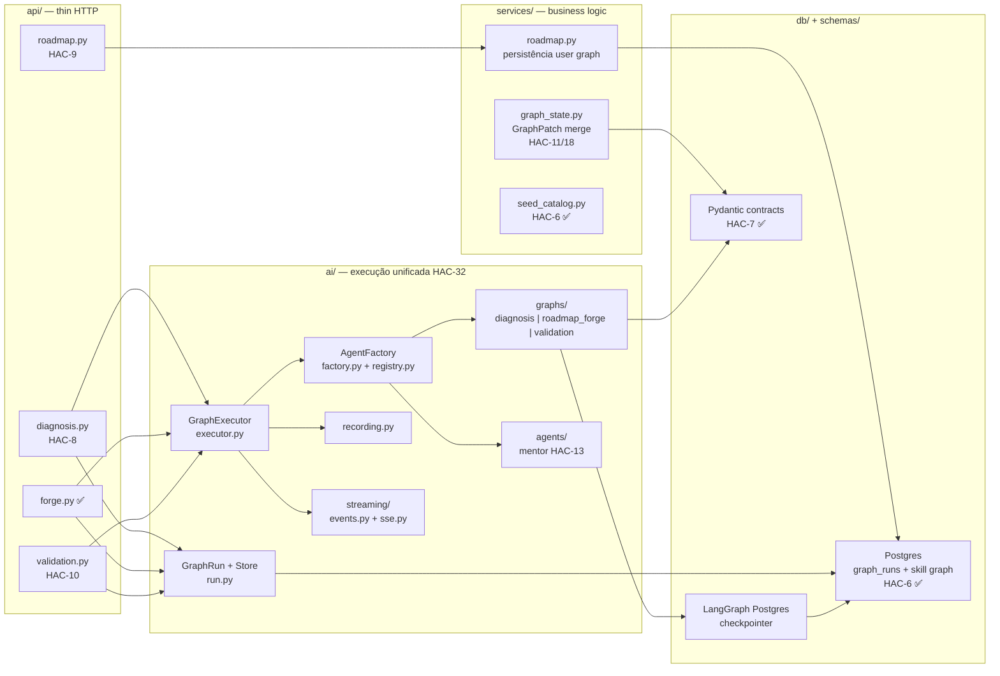
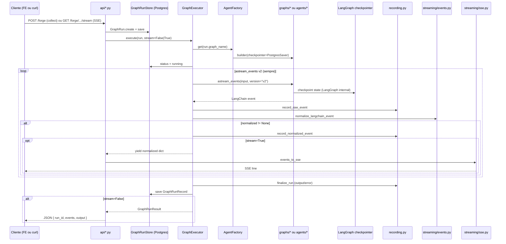

# Execution flow — Career Forge (canonical)

> **Navigation:** [AI-EXECUTION.md](./AI-EXECUTION.md) · [REPO-STRUCTURE.md](./REPO-STRUCTURE.md) · [SPRINT-BOARD.md](../SPRINT-BOARD.md) · [CHECKPOINT.md](../CHECKPOINT.md)

End-to-end execution tree, parallel dispatch order, and architecture after Sprint 6 + deploy hardening.

Last updated: **HAC-51**

---

## State snapshot

| Area | Status |
|------|--------|
| Sprint 0 → Sprint 6 | ✅ Done (HAC-5..15, HAC-33, HAC-42..47) |
| AI layer | ✅ `career_forge/ai/` — GraphRun, GraphExecutor, AgentFactory |
| Graph builders | ✅ `diagnosis`, `diagnosis_interview`, `roadmap_forge`, `validation`, `mock_interview`; mentor as agent runnable |
| HTTP | ✅ diagnosis, diagnosis interview, forge, roadmap, validation, mentor, mentor report, mock interview routes wired |
| Persistence | ✅ `GraphRunRecord` + `graph_runs` table; diagnosis sessions and skill graph state persisted in Postgres |

---

## North star demo flow

```
Onboarding (HAC-8)
  → Live Roadmap Forge — timeline SSE only (HAC-18)
  → animation reveal → vertical roadmap artifact (HAC-9)
  → Validar com IA (HAC-10)
  → trilha reage — GraphPatch (HAC-11)
  → pitch demo Ana (HAC-12)
```

**User reaction targets:** "Tô vendo a IA pensar" (forge stream) · "Não deixa eu mentir que aprendi" (validation) · "A trilha mudou porque eu errei" (adaptive).

Full demo script: [CHECKPOINT.md](../CHECKPOINT.md) § Demo script.

---

## User journey — `(setup)` vs `(artifact)`



| Layer | Route group | Purpose |
|-------|-------------|---------|
| **(setup)** | `(setup)/` | Onboarding diagnóstico editável (HAC-8) → Live Roadmap Forge with **timeline-only SSE** during stream (HAC-18). No graph preview during stream. |
| **(artifact)** | `(artifact)/` | Vertical roadmap.sh-style trail (HAC-9) → mastery validation (HAC-10) → adaptive graph (HAC-11) → demo Ana (HAC-12). |

---

## Backend flow — API → services → ai/



**Layer rules:** `api/` creates `GraphRun` and calls `GraphExecutor` only. `services/` handles deterministic merge and DB persistence — no streaming. `ai/` owns all LangChain/LangGraph execution. For endpoint-level API map, see [CHECKPOINT.md](../CHECKPOINT.md) § Application map.

---

## GraphExecutor — single path (stream vs collect)



**Golden rule:** `astream_events` v2 lives **only** in `GraphExecutor`. Never duplicate streaming in `api/` or per-graph modules.

Details: [AI-EXECUTION.md](./AI-EXECUTION.md)

---

## Persistence — Postgres checkpointer (canonical)

Two complementary Postgres layers:

| Layer | Purpose | Implementation |
|-------|---------|----------------|
| **GraphRun store** | Application audit record — id, graph_name, user_id, status, I/O, raw/normalized events | `GraphRunRecord` → `graph_runs` table (Alembic `002_graph_runs`). Implement `PostgresGraphRunStore` satisfying `GraphRunStore` protocol in `ai/run.py`. |
| **LangGraph checkpointer** | Graph internal state between nodes / resume / human-in-the-loop | LangGraph **Postgres checkpointer** pattern (`PostgresSaver` / `langgraph-checkpoint-postgres`). Same Postgres instance; separate checkpoint tables managed by LangGraph. |

**Canonical target:** Postgres for both layers. **`InMemoryGraphRunStore`** remains as dev/test fallback (pytest, local smoke without DB) — not production default.

**Wiring status (HAC-32):**

- ✅ `GraphRunRecord` model + `graph_runs` migration
- ⬜ `PostgresGraphRunStore` replacing module-level `_default_store`
- ⬜ `PostgresSaver` injected into graph builders via `AgentFactory`
- ⬜ Replace `MockGraphRunnable` with compiled LangGraph graphs (HAC-8/10/18)

---

## Issue placement map

| Issue | Layer | Target modules |
|-------|-------|----------------|
| **HAC-5** ✅ | Infra | `apps/frontend`, `apps/backend`, `docker-compose`, `Makefile` |
| **HAC-6** ✅ | Data | `data/roadmap.json`, `db/models/`, Alembic, `scripts/seed.py` |
| **HAC-7** ✅ | Contracts | `schemas/diagnosis.py`, `forge.py`, `validation.py`, `planning.py` |
| **HAC-32** ✅ | AI core | `ai/run.py`, `executor.py`, `factory.py`, `registry.py`, `recording.py`, `streaming/` |
| **HAC-8** | Setup + diagnosis | `ai/graphs/diagnosis.py`, `api/diagnosis.py`, `(setup)/onboarding`, `components/diagnosis/` |
| **HAC-18** | Forge wow | `ai/graphs/roadmap_forge.py`, `services/graph_state.py`, `api/forge.py` ✅, `(setup)/forge`, `components/forge/`, `components/streaming/` |
| **HAC-9** | Artifact UI | `api/roadmap.py`, `services/roadmap.py`, `(artifact)/roadmap`, `components/roadmap/` |
| **HAC-10** | Mastery loop | `ai/graphs/validation.py`, `api/validation.py`, validation UI in artifact |
| **HAC-11** | Adaptive | `services/graph_state.py`, `schemas/planning.py`, post-validation recalibration |
| **HAC-12** | Demo | seed Ana, E2E pitch 7 min |
| **HAC-13** [P] | Stretch | `ai/agents/mentor.py`, mentor route, artifact sidebar |
| **HAC-14** [P] | Stretch | mock interview loop (recalibrates trail) |
| **HAC-15** [P] | Stretch | mentor report (depends HAC-10) |

---

## ASCII execution tree

```
Career Forge — execução E2E (pós-HAC-32)
│
├─ FRONTEND  apps/frontend/src/
│  ├─ (setup)/
│  │  ├─ /onboarding ────────────── HAC-8  → POST /diagnosis
│  │  └─ /forge ─────────────────── HAC-18 → GET /forge/stream (SSE timeline)
│  └─ (artifact)/
│     └─ /roadmap ───────────────── HAC-9  → GET /roadmap
│        ├─ Validar ─────────────── HAC-10 → POST /validation → GraphExecutor(validation)
│        ├─ Trilha reativa ──────── HAC-11 → services/graph_state.apply_graph_patch
│        ├─ Chat mentor ─────────── HAC-13 → GraphExecutor(mentor)
│        └─ Demo Ana ────────────── HAC-12
│
└─ BACKEND  apps/backend/src/career_forge/
   ├─ api/          thin HTTP (cria GraphRun, chama executor)
   │  ├─ diagnosis.py   [stub → HAC-8]
   │  ├─ forge.py       [✅ wired]
   │  ├─ roadmap.py     [stub → HAC-9]
   │  └─ validation.py  [stub → HAC-10]
   │
   ├─ services/     business logic (sem streaming)
   │  ├─ roadmap.py      persistência user graph (HAC-9/18)
   │  ├─ graph_state.py  GraphPatch merge determinístico (HAC-11/18)
   │  └─ seed_catalog.py ✅
   │
   ├─ ai/           execução unificada HAC-32
   │  ├─ run.py          GraphRun + GraphRunStore (Postgres canonical; InMemory dev fallback)
   │  ├─ executor.py     ÚNICO caminho astream_events v2
   │  ├─ factory.py      AgentFactory.get(name) + checkpointer injection
   │  ├─ registry.py     diagnosis | roadmap_forge | validation | mentor
   │  ├─ recording.py     raw + normalized events → GraphRun
   │  ├─ streaming/
   │  │  ├─ events.py    LC v2 → RoadmapForgeEvent / graph_complete
   │  │  └─ sse.py       wire SSE
   │  ├─ graphs/         LangGraph builders + PostgresSaver checkpointer
   │  └─ agents/         mentor (HAC-13)
   │
   ├─ schemas/      Pydantic I/O ✅ HAC-7
   └─ db/           Postgres
      ├─ models/graph_run.py   GraphRunRecord → graph_runs ✅
      └─ (LangGraph checkpoint tables via PostgresSaver)
```

---

## Parallel dispatch order

Reference: [parallel-dispatch.mdc](../../.cursor/rules/parallel-dispatch.mdc) · [SPRINT-BOARD.md](../SPRINT-BOARD.md)

| Issue | Class | Depends on | Parallel with |
|-------|-------|------------|---------------|
| HAC-5 ✅ | P | HAC-19 ✅ | HAC-6, HAC-7 |
| HAC-6 ✅ | P | HAC-19 ✅ | HAC-5, HAC-7 |
| HAC-7 ✅ | P | HAC-19 ✅ | HAC-5, HAC-6 |
| HAC-31 ✅ | — | HAC-5 | — |
| HAC-32 ✅ | — | HAC-7 | — |
| **HAC-8** | **S** | HAC-5,6,7 ✅ | **None** — next in queue |
| **HAC-18** | **S** | HAC-8 | **None** until HAC-8 merges |
| **HAC-9** | **S** | HAC-18 | **None** until HAC-18 merges |
| **HAC-10** | **S** | HAC-9 | **None** |
| **HAC-11** | **S** | HAC-10 | **None** |
| **HAC-12** | **S** | HAC-11 | **None** |
| **HAC-13** | **P** | HAC-12 | HAC-14 (after HAC-12) |
| **HAC-14** | **P** | HAC-12 | HAC-13 (after HAC-12) |
| **HAC-15** | **P** | HAC-10 + HAC-12 | HAC-13, HAC-14 (after deps OK) |

### Dispatch quick reference

```
Sprint 1:  [P] HAC-5 + HAC-6 + HAC-7  →  ONE message, 3 subagents  ✅
Sprint 2:  [S] HAC-8 → HAC-18         ← NEXT (sequential)
Sprint 3:  [S] HAC-9
Sprint 4:  [S] HAC-10 → HAC-11 → HAC-12
Sprint 5:  [P] HAC-13 + HAC-14 + HAC-15  →  ONE message, 3 subagents
```

**Practical note:** within a single issue (e.g. HAC-8), FE and BE can progress in parallel on the same branch. Do **not** parallelize sibling issues in `[S]` chains before upstream merge.

---

## New session handoff

Bootstrap paste block and subagent Task template: [AGENTS.md](../../AGENTS.md) § Nova sessão — bootstrap manual.

---

## Git worktrees (agent isolation)

Use a **sibling worktree** outside the main checkout so issue work does not pollute the primary workspace:

```bash
# From HB01-2026_soft-push on main
git worktree add ../worktrees/hac-XX-<slug> -b hac-XX-<slug> origin/main
cd ../worktrees/hac-XX-<slug>
# implement → test → merge to main from worktree or main checkout
```

After merge + end-task:

```bash
git worktree remove ../worktrees/hac-XX-<slug>
git branch -d hac-XX-<slug>
```

Keep `main` clean for harness/docs and parallel prep; one worktree per active `[S]` issue.

---

*HB01-2026 · Programadores Sem Pátria*
