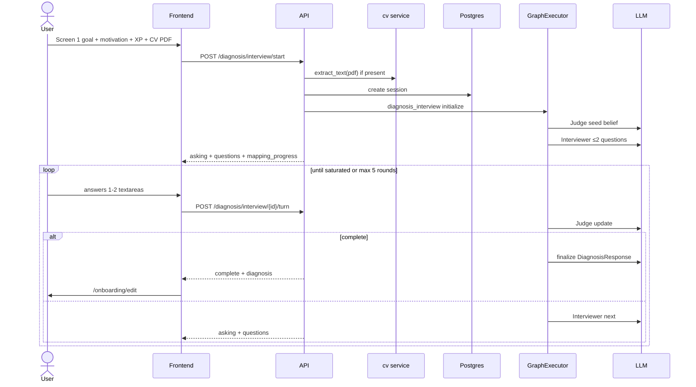

# Diagnosis interview — product + engineering spec

> **Authority:** [ADR-001](../decisions/ADR-001-adaptive-diagnosis-ctrr.md) (business decisions) · this doc (operational spec) · [V2-PLAN.md](../V2-PLAN.md) (v2 soft gate / audience)

**Status:** Implemented in production path. v2 F2 recalibrates prompts for BASE/PSP + LLM tracks; pilot uses **soft gate** (lean forge + warning) below score bar.

---

## User flow



---

## API

### `POST /diagnosis/interview/start`

**Body:**

```typescript
{
  user_id: string
  goal_id: string
  motivation: string
  years_xp?: "0-1" | "1-3" | "3-5" | "5+"
  cv?: { filename: string; mime_type: "application/pdf"; content_base64: string }
}
```

**Response:**

```typescript
{
  session_id: string
  status: "asking"
  questions: InterviewQuestion[]  // 0-2
  mapping_progress: RubricMapItem[]
}
```

### `POST /diagnosis/interview/{session_id}/turn`

**Body:**

```typescript
{
  answers: { question_id: string; text: string }[]
}
```

**Response:** same shape; `status: "asking" | "complete"`; `diagnosis` when complete.

---

## Schemas (Pydantic)

| Model | Purpose |
|-------|---------|
| `DiagnosisIntake` | Screen 1 payload |
| `CvAttachment` | PDF metadata + extracted text |
| `CvSignals` | LLM-structured extract from CV (optional pass) |
| `RubricDimension` | key, label, confidence, evidence[] |
| `BeliefState` | dict of dimensions |
| `InterviewQuestion` | topic, rubric_key, question, example_of_answer, id |
| `InterviewTurn` | questions + answers append-only |
| `DiagnosisSession` | intake, belief, transcript, status |

Register graph: `diagnosis_interview` in `ai/registry.py`.

---

## Graph nodes (`diagnosis_interview`)

1. `ingest_intake` — normalize intake + cv_text
2. `extract_cv_signals` — optional structured LLM pass on cv_text
3. `initialize_belief` — Judge
4. `plan_questions` — Interviewer (≤2)
5. *(wait — API turn)*
6. `update_belief` — Judge from answers
7. `check_saturation` — threshold or max_rounds
8. `finalize_diagnosis` — belief → `DiagnosisResponse`

Execution: `GraphExecutor.execute(..., stream=False)` per turn.

---

## Prompts (outline)

### Interviewer system

- Audience: career transition, beginner-friendly Portuguese
- Input: `RUBRIC_JSON`, `BELIEF_JSON`, `TRANSCRIPT_JSON`, `INTAKE_JSON`
- Rules: max 2 questions; only `confidence < 0.75`; no repeat of intake/CV/transcript; output JSON array

### Judge system

- Update confidence + evidence per `rubric_key`
- Output strict JSON matching `BeliefState`

### Finalize

- Map saturated belief → `strengths`, `gaps`, `starting_priorities`, `estimated_mastery`

---

## Frontend rules

- **No** `DIAG_ROUNDS` for production path
- Render `questions[]` from API; sidebar from `mapping_progress`
- Min answer length per UX (e.g. 8 chars) — client validation only
- Session id in sessionStorage key `career-forge.diagnosis-session-id`

See [`components/diagnosis/AGENTS.md`](../../apps/frontend/src/components/diagnosis/AGENTS.md).

---

## CV ingest

| Step | Owner | LLM? |
|------|-------|------|
| Validate PDF mime/size | `services/cv.py` | No |
| Extract text | pypdf/pdfplumber | No |
| `CvSignals` struct | `services/cv.py` or graph node | Yes (once) |

---

## Testing

- Unit: belief saturation logic, schema validation
- Integration: mock LLM → 3-turn golden path → `DiagnosisResponse`
- Gate B: fill 2 questions → next round → complete → edit screen

---

## Anti-patterns

- ❌ Hardcoded question rounds in `onboarding-data.ts` (prod)
- ❌ Keyword scoring as production diagnosis
- ❌ FE deciding next topic
- ❌ CV required to proceed
- ❌ Streaming per question (use collect per turn)
